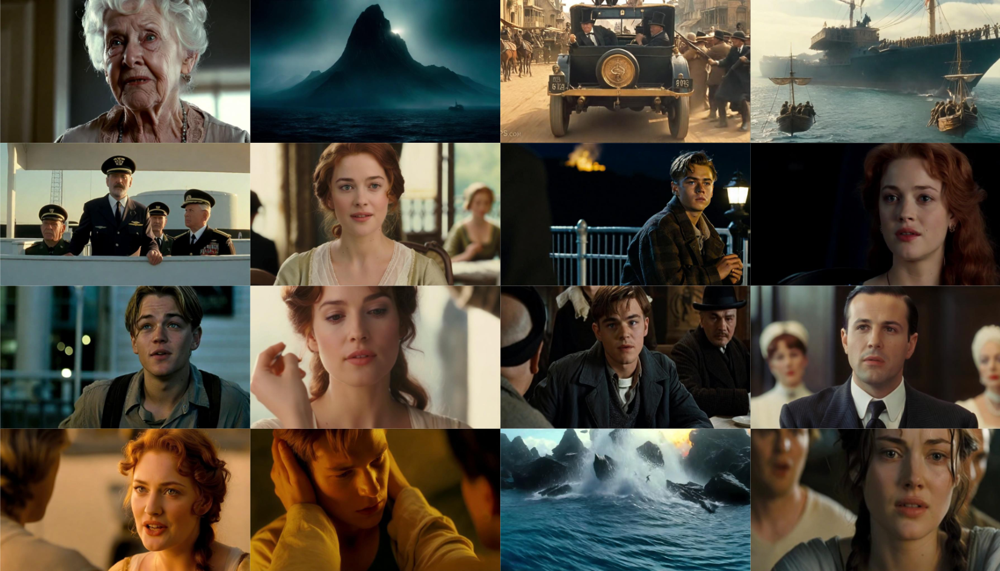

<p align="center">
  
</p>
<hr>
<div align="center">
  
## MovieDreamer: Hierarchical Generation for Coherent Long Visual Sequences

<p align="center">
  <a href="https://aim-uofa.github.io/MovieDreamer/"><b>📖 Project Page</b></a> |
  <a href="https://arxiv.org/abs/2407.16655"><b>📄 Paper Link</b></a> |
  <a href="https://huggingface.co/papers/2407.16655"><b>🤗 Huggingface Paper Link</b></a> |
  <a href="https://www.youtube.com/watch?v=aubRVOGrKLU"><b>📹 Demo</b></a>
</p>

</div>

> MovieDreamer aims to provide a solution for long content generation. Our method is capable of generating both long story and long video with multiple characters well-preserved!

<div align="center">
    
</div>

## 📣 News
- [7/20/2024] Paper released!

## 😲 Results
Please refer to our [homepage](https://aim-uofa.github.io/MovieDreamer/) for more thrilling results!


## 🛠️ Setup
- Comming Soon...


## 🚩 Plan
- [x] Story Results and Video Results.
- [x] Paper Released.
- [ ] Source Code and Pretrained Weights of Diffusion AutoEncoder.
- [ ] Source Code and Pretrained Weights of Autoregressive Model.
- [ ] Source code of Video Generation.
- [ ] Source code of Data Pre-processing.
- [ ] Source code of Training.
<!-- --- -->


## 🎫 License

For academic use, this project is licensed under [the 2-clause BSD License](https://opensource.org/license/bsd-2-clause). 
For commercial use, please contact [Chunhua Shen](chhshen@gmail.com).

## 🖊️ Citation
```
@misc{zhao2024moviedreamerhierarchicalgenerationcoherent,
      title={MovieDreamer: Hierarchical Generation for Coherent Long Visual Sequence}, 
      author={Canyu Zhao and Mingyu Liu and Wen Wang and Jianlong Yuan and Hao Chen and Bo Zhang and Chunhua Shen},
      year={2024},
      eprint={2407.16655},
      archivePrefix={arXiv},
      primaryClass={cs.CV},
      url={https://arxiv.org/abs/2407.16655}, 
}
```
